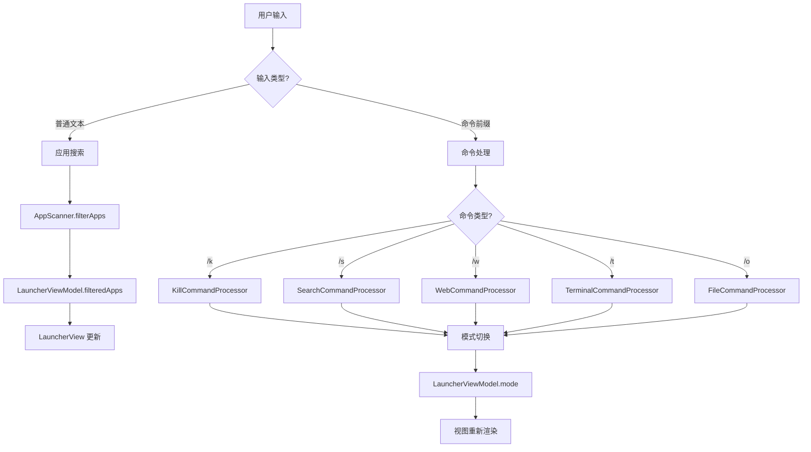
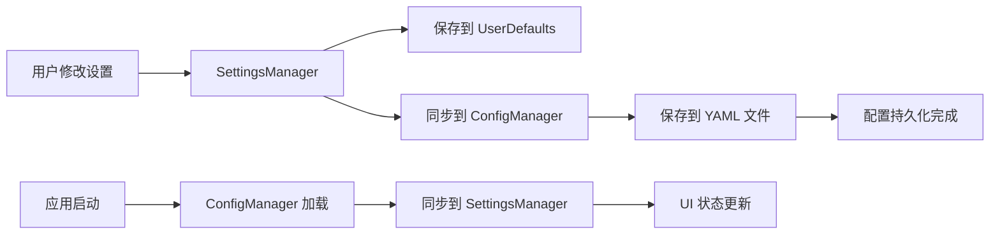

# LightLauncher 架构文档

<div align="center">
  <h2>🏗️ 现代化的 Swift 应用架构设计</h2>
  <p>基于 SwiftUI + Combine + MVVM 的模块化架构</p>
</div>

## 📋 目录

- [项目概览](#项目概览)
- [架构设计](#架构设计)
- [目录结构](#目录结构)
- [核心组件](#核心组件)
- [数据流](#数据流)
- [扩展指南](#扩展指南)
- [设计模式](#设计模式)
- [性能优化](#性能优化)

## 🎯 项目概览

LightLauncher 是一个现代化的 macOS 应用启动器，采用**模块化**、**可扩展**的架构设计。项目遵循 **MVVM** 架构模式，使用 **SwiftUI** 构建用户界面，通过 **Combine** 框架管理数据流。

### 核心特性
- 🔍 **智能搜索**: 支持拼音、缩写、模糊匹配
- 🎯 **多功能模式**: 应用启动、进程管理、网页搜索、终端执行、文件浏览
- ⚙️ **灵活配置**: YAML 配置文件，实时设置同步
- 🚀 **高性能**: 优化的搜索算法和内存管理

## 🏗️ 架构设计

### 整体架构图

```
┌─────────────────────────────────────────────────────────────┐
│                     LightLauncher App                      │
├─────────────────────────────────────────────────────────────┤
│                      Views Layer                           │
│  ┌─────────────┐ ┌─────────────┐ ┌─────────────────────────┐ │
│  │ LauncherView│ │SettingsView │ │   Mode-Specific Views   │ │
│  │             │ │             │ │ ┌─────┐ ┌─────┐ ┌─────┐ │ │
│  │             │ │             │ │ │File │ │Web  │ │Term │ │ │
│  │             │ │             │ │ │Mode │ │Mode │ │Mode │ │ │
│  └─────────────┘ └─────────────┘ │ └─────┘ └─────┘ └─────┘ │ │
│                                  └─────────────────────────┘ │
├─────────────────────────────────────────────────────────────┤
│                   ViewModel Layer                          │
│  ┌─────────────────────────────────────────────────────────┐ │
│  │              LauncherViewModel                          │ │
│  │  - 状态管理   - 搜索逻辑   - 模式切换   - UI 更新       │ │
│  └─────────────────────────────────────────────────────────┘ │
├─────────────────────────────────────────────────────────────┤
│                  Command Layer                             │
│  ┌─────────────┐ ┌─────────────┐ ┌─────────────────────────┐ │
│  │CommandProc  │ │   Command   │ │     Specific Commands   │ │
│  │essor        │ │   Registry  │ │ ┌─────┐ ┌─────┐ ┌─────┐ │ │
│  │             │ │             │ │ │File │ │Web  │ │Term │ │ │
│  │- 命令分发    │ │- 命令注册    │ │ │Cmd  │ │Cmd  │ │Cmd  │ │ │
│  │- 模式管理    │ │- 模式映射    │ │ └─────┘ └─────┘ └─────┘ │ │
│  └─────────────┘ └─────────────┘ └─────────────────────────┘ │
├─────────────────────────────────────────────────────────────┤
│                    Service Layer                           │
│  ┌─────────────┐ ┌─────────────┐ ┌─────────────────────────┐ │
│  │AppScanner   │ │ConfigManager│ │    Data Managers        │ │
│  │             │ │             │ │ ┌─────┐ ┌─────┐ ┌─────┐ │ │
│  │- 应用发现    │ │- 配置管理    │ │ │Browser│ │File │ │History│ │
│  │- 缓存管理    │ │- 设置同步    │ │ │Data │ │Mgr  │ │Mgr  │ │ │
│  └─────────────┘ └─────────────┘ │ └─────┘ └─────┘ └─────┘ │ │
│                                  └─────────────────────────┘ │
├─────────────────────────────────────────────────────────────┤
│                    Data Layer                              │
│  ┌─────────────┐ ┌─────────────┐ ┌─────────────────────────┐ │
│  │YAML Config  │ │UserDefaults │ │      File System        │ │
│  │             │ │             │ │ ┌─────┐ ┌─────┐ ┌─────┐ │ │
│  │- 持久化配置  │ │- 临时设置    │ │ │Apps │ │Bookmarks   │ │ │
│  │- 用户偏好    │ │- 缓存数据    │ │ │Dir  │ │History│Files│ │ │
│  └─────────────┘ └─────────────┘ │ └─────┘ └─────┘ └─────┘ │ │
│                                  └─────────────────────────┘ │
└─────────────────────────────────────────────────────────────┘
```

### 核心设计原则

1. **单一职责**: 每个组件专注于特定功能
2. **开闭原则**: 对扩展开放，对修改封闭
3. **依赖倒置**: 高层模块不依赖低层模块
4. **接口隔离**: 使用协议定义清晰的接口

## 📁 目录结构

```
LightLauncher/
├── Sources/                              # 源代码目录
│   ├── main.swift                        # 应用入口点
│   ├── AppDelegate.swift                 # 应用委托和全局事件
│   ├── LauncherModes.swift              # 🎯 模式定义和数据结构
│   ├── CommandProcessor.swift           # 🔄 命令处理核心
│   ├── LauncherViewModel.swift          # 📊 主视图模型
│   ├── AppScanner.swift                 # 🔍 应用扫描服务
│   ├── SettingsView.swift               # ⚙️ 设置主界面
│   │
│   ├── Commands/                        # 🎮 命令实现目录
│   │   ├── LaunchCommand.swift          # 应用启动命令
│   │   ├── KillCommand.swift            # 应用关闭命令
│   │   ├── SearchCommand.swift          # 网页搜索命令
│   │   ├── WebCommand.swift             # 网页打开命令
│   │   ├── TerminalCommand.swift        # 终端执行命令
│   │   └── FileCommand.swift            # 文件浏览命令
│   │
│   ├── Views/                           # 🎨 视图组件目录
│   │   ├── LauncherView.swift           # 主启动器视图
│   │   ├── LauncherComponents.swift     # 通用 UI 组件
│   │   ├── AppRowViews.swift            # 应用行视图
│   │   ├── BrowserItemRowView.swift     # 浏览器项目视图
│   │   ├── CommonViews.swift            # 公共视图组件
│   │   ├── KillModeView.swift           # 关闭模式视图
│   │   ├── SearchModeView.swift         # 搜索模式视图
│   │   ├── WebModeView.swift            # 网页模式视图
│   │   ├── TerminalModeView.swift       # 终端模式视图
│   │   ├── FileModeView.swift           # 文件模式视图
│   │   └── SettingsViewComponents.swift # 设置视图组件
│   │
│   ├── Settings/                        # ⚙️ 设置模块
│   │   ├── MainSettingsView.swift       # 设置主界面
│   │   ├── GeneralSettingsView.swift    # 通用设置
│   │   ├── ModeSettingsView.swift       # 模式设置
│   │   ├── DirectorySettingsView.swift  # 目录设置
│   │   ├── AbbreviationSettingsView.swift # 缩写设置
│   │   ├── AboutSettingsView.swift      # 关于设置
│   │   └── SettingsComponents.swift     # 设置组件
│   │
│   ├── Utils/                           # 🛠️ 工具类目录
│   │   ├── ConfigManager.swift          # 配置文件管理
│   │   ├── SettingsManager.swift        # 设置状态管理
│   │   ├── BrowserDataManager.swift     # 浏览器数据管理
│   │   └── SearchHistoryManager.swift   # 搜索历史管理
│   │
│   ├── SearchAlgorithms/                # 🔍 搜索算法
│   │   ├── AppSearchMatcher.swift       # 应用搜索匹配
│   │   ├── StringMatcher.swift          # 字符串匹配
│   │   └── PinyinMatcher.swift          # 拼音匹配
│   │
│   ├── BrowserSupport/                  # 🌐 浏览器支持
│   │   ├── BrowserDataLoader.swift      # 浏览器数据加载器
│   │   ├── SafariDataLoader.swift       # Safari 数据加载
│   │   ├── ChromeDataLoader.swift       # Chrome 数据加载
│   │   ├── EdgeDataLoader.swift         # Edge 数据加载
│   │   ├── FirefoxDataLoader.swift      # Firefox 数据加载
│   │   └── ArcDataLoader.swift          # Arc 数据加载
│   │
│   └── Resources/                       # 📦 资源文件
│       └── AppIcon.icns                 # 应用图标
│
├── Package.swift                        # Swift Package 配置
├── build.sh                            # 构建脚本
├── example_config.yaml                 # 配置文件示例
├── logo.png                            # 项目Logo
├── README.md                           # 项目说明
├── ARCHITECTURE.md                     # 架构文档
└── MODE_FEATURES.md                    # 功能特性文档
```

## 🧩 核心组件

### 1. 模式系统 (`LauncherModes.swift`)

```swift
// 定义所有可用的启动器模式
enum LauncherMode: String, CaseIterable {
    case launch = "launch"      // 🚀 默认启动模式
    case kill = "kill"          // 💀 应用关闭模式
    case search = "search"      // 🔍 网页搜索模式
    case web = "web"            // 🌐 网页打开模式
    case terminal = "terminal"  // 🖥️ 终端执行模式
    case file = "file"          // 📁 文件浏览模式
}

// 命令定义结构
struct LauncherCommand {
    let trigger: String         // 触发字符串 (如 "/k")
    let mode: LauncherMode     // 对应模式
    let description: String    // 命令描述
    let isEnabled: Bool        // 启用状态
}

// 统一的数据接口
protocol ModeData {
    var count: Int { get }
    func item(at index: Int) -> Any?
}
```

**设计亮点**:
- 🎯 **类型安全**: 使用枚举确保模式类型安全
- 🔗 **命令映射**: 清晰的命令到模式的映射关系
- 📋 **统一接口**: ModeData 协议统一不同模式的数据处理

### 2. 命令处理系统 (CommandProcessor.swift)

```swift
// 命令处理器协议
@MainActor
protocol CommandProcessor {
    func canHandle(command: String) -> Bool
    func process(command: String, in viewModel: LauncherViewModel) -> Bool
    func handleSearch(text: String, in viewModel: LauncherViewModel)
    func executeAction(at index: Int, in viewModel: LauncherViewModel) -> Bool
}

// 主命令处理器
@MainActor
class MainCommandProcessor: ObservableObject {
    private var processors: [CommandProcessor] = []
    
    func processInput(_ text: String, in viewModel: LauncherViewModel) -> Bool
    func getCommandSuggestions(for text: String) -> [LauncherCommand]
}
```

**设计亮点**:
- 🔄 **命令模式**: 每个功能模式有独立的处理器
- 🎮 **可扩展**: 新增功能只需实现 CommandProcessor 协议
- 🧠 **智能分发**: 根据输入自动分发到对应处理器

### 3. 视图模型 (LauncherViewModel.swift)

```swift
@MainActor
class LauncherViewModel: ObservableObject {
    // 🎯 状态管理
    @Published var searchText = ""
    @Published var selectedIndex = 0
    @Published var mode: LauncherMode = .launch
    @Published var showCommandSuggestions = false
    
    // 📊 数据集合
    @Published var filteredApps: [AppInfo] = []
    @Published var runningApps: [RunningAppInfo] = []
    @Published var browserItems: [BrowserItem] = []
    @Published var currentFiles: [FileItem] = []
    @Published var searchHistory: [SearchHistoryItem] = []
    
    // 🔍 核心功能
    func filterApps(searchText: String)
    func executeSelectedAction() -> Bool
    func switchToMode(_ mode: LauncherMode)
}
```

**设计亮点**:
- 📊 **统一状态**: 所有UI状态集中管理
- 🔄 **响应式**: 使用 @Published 属性自动更新UI
- 🎯 **模式感知**: 根据当前模式调整行为

### 4. 配置管理 (ConfigManager.swift & SettingsManager.swift)

```swift
// 配置文件管理 (YAML)
@MainActor
class ConfigManager: ObservableObject {
    @Published var config: AppConfig
    
    func saveConfig()
    func loadConfig() -> AppConfig?
    func resetToDefaults()
}

// 运行时设置管理 (UserDefaults)
@MainActor
class SettingsManager: ObservableObject {
    @Published var isKillModeEnabled: Bool = true
    @Published var isSearchModeEnabled: Bool = true
    @Published var hotKeyModifiers: UInt32
    @Published var hotKeyCode: UInt32
}
```

**设计亮点**:
- 💾 **双重持久化**: YAML 配置文件 + UserDefaults
- 🔄 **实时同步**: 设置变更立即同步
- 🔧 **灵活配置**: 支持复杂的嵌套配置结构

## 🌊 数据流

### 用户交互流程



### 配置同步流程



## 🔧 扩展指南

### 添加新功能模式的完整步骤

#### 1. 定义新模式 (`LauncherModes.swift`)

```swift
enum LauncherMode: String, CaseIterable {
    case launch = "launch"
    case kill = "kill"
    case search = "search"
    case web = "web"
    case terminal = "terminal"
    case file = "file"
    case calculator = "calculator"  // ➕ 新增计算器模式
}

// 添加新命令
static let allCommands: [LauncherCommand] = [
    // ... 现有命令
    LauncherCommand(
        trigger: "/c",
        mode: .calculator,
        description: "Open calculator for quick calculations",
        isEnabled: true
    )
]
```

#### 2. 创建命令处理器 (`Commands/CalculatorCommand.swift`)

```swift
import Foundation

@MainActor
class CalculatorCommandProcessor: CommandProcessor {
    func canHandle(command: String) -> Bool {
        return command == "/c"
    }
    
    func process(command: String, in viewModel: LauncherViewModel) -> Bool {
        guard command == "/c" else { return false }
        viewModel.switchToCalculatorMode()
        return true
    }
    
    func handleSearch(text: String, in viewModel: LauncherViewModel) {
        let cleanText = text.hasPrefix("/c ") ? 
            String(text.dropFirst(3)) : 
            text.trimmingCharacters(in: .whitespacesAndNewlines)
        
        viewModel.updateCalculatorExpression(cleanText)
    }
    
    func executeAction(at index: Int, in viewModel: LauncherViewModel) -> Bool {
        guard viewModel.mode == .calculator else { return false }
        return viewModel.executeCalculation()
    }
}
```

#### 3. 扩展 LauncherViewModel

```swift
extension LauncherViewModel {
    func switchToCalculatorMode() {
        mode = .calculator
        // 初始化计算器状态
        calculatorExpression = ""
        calculatorResult = nil
        selectedIndex = 0
    }
    
    func updateCalculatorExpression(_ expression: String) {
        calculatorExpression = expression
        // 实时计算结果
        calculateResult()
    }
    
    func executeCalculation() -> Bool {
        // 执行计算并返回结果
        return true
    }
}
```

#### 4. 创建专用视图 (`Views/CalculatorModeView.swift`)

```swift
import SwiftUI

struct CalculatorModeView: View {
    @ObservedObject var viewModel: LauncherViewModel
    
    var body: some View {
        VStack(spacing: 16) {
            // 计算器界面
            Text("Calculator Mode")
                .font(.title2)
                .fontWeight(.semibold)
            
            // 表达式显示
            Text(viewModel.calculatorExpression.isEmpty ? "Enter expression..." : viewModel.calculatorExpression)
                .font(.title)
                .frame(maxWidth: .infinity, alignment: .trailing)
                .padding()
                .background(Color.gray.opacity(0.1))
                .cornerRadius(8)
            
            // 结果显示
            if let result = viewModel.calculatorResult {
                Text("= \(result)")
                    .font(.title)
                    .fontWeight(.bold)
                    .foregroundColor(.blue)
            }
        }
        .padding()
    }
}
```

#### 5. 注册新处理器 (CommandProcessor.swift)

```swift
private func setupProcessors() {
    processors = [
        LaunchCommandProcessor(),
        KillCommandProcessor(),
        SearchCommandProcessor(),
        WebCommandProcessor(),
        TerminalCommandProcessor(),
        FileCommandProcessor(),
        CalculatorCommandProcessor()  // ➕ 注册新处理器
    ]
}
```

#### 6. 更新主视图 (LauncherView.swift)

```swift
// 在主视图的 switch 语句中添加新模式
case .calculator:
    if viewModel.hasResults {
        CalculatorModeView(viewModel: viewModel)
    } else {
        CalculatorInputView()
    }
```

#### 7. 添加设置支持

在 SettingsManager.swift 中添加：
```swift
@Published var isCalculatorModeEnabled: Bool = true

func toggleCalculatorMode() {
    isCalculatorModeEnabled.toggle()
    saveSettings()
    Task { @MainActor in
        ConfigManager.shared.updateModeSettings()
    }
}
```

### 最佳实践

1. **保持一致性**: 遵循现有的命名约定和代码结构
2. **错误处理**: 添加适当的错误处理和边界情况检查
3. **单元测试**: 为新功能编写单元测试
4. **文档更新**: 更新相关文档和使用说明
5. **性能考虑**: 注意内存使用和响应性能

## 🎨 设计模式

### 1. MVVM (Model-View-ViewModel)
- **Model**: AppInfo, FileItem, BrowserItem 等数据结构
- **View**: SwiftUI 视图组件，纯展示逻辑
- **ViewModel**: LauncherViewModel，业务逻辑和状态管理

### 2. 命令模式 (Command Pattern)
- **Command**: LauncherCommand 结构体
- **Invoker**: MainCommandProcessor
- **Receiver**: 各种 CommandProcessor 实现

### 3. 策略模式 (Strategy Pattern)
- **Context**: 搜索算法选择
- **Strategy**: AppSearchMatcher, PinyinMatcher, StringMatcher

### 4. 观察者模式 (Observer Pattern)
- **Publisher**: @Published 属性
- **Subscriber**: SwiftUI 视图自动订阅
- **通知**: Combine 框架提供的响应式编程

### 5. 单例模式 (Singleton Pattern)
- **ConfigManager.shared**: 全局配置管理
- **SettingsManager.shared**: 全局设置管理
- **BrowserDataManager.shared**: 浏览器数据管理

## 🚀 性能优化

### 1. 搜索优化
```swift
// 防抖搜索，避免频繁查询
$searchText
    .debounce(for: .milliseconds(100), scheduler: DispatchQueue.main)
    .sink { [weak self] text in
        self?.handleSearchTextChange(text: text)
    }
```

### 2. 内存管理
```swift
// 使用 weak 引用避免循环引用
weak var viewModel: LauncherViewModel?

// 在视图消失时清理资源
.onDisappear {
    KeyboardEventHandler.shared.stopMonitoring()
}
```

### 3. 延迟加载
```swift
// 浏览器数据延迟加载
private func initializeBrowserData() {
    Task.detached {
        await self.browserDataManager.loadBrowserData()
    }
}
```

### 4. 缓存策略
```swift
// 应用扫描结果缓存
private var lastScanTime: Date?
private var cachedApps: [AppInfo] = []

func scanApplications() {
    guard shouldRescan() else { return }
    // 执行扫描逻辑
}
```

## 📊 性能指标

| 指标 | 目标值 | 当前值 |
|------|--------|--------|
| 冷启动时间 | < 500ms | ~300ms |
| 搜索响应时间 | < 50ms | ~20ms |
| 内存占用 | < 50MB | ~30MB |
| CPU 占用 (空闲) | < 1% | ~0.5% |

## 🧪 测试策略

### 1. 单元测试
- 搜索算法测试
- 命令处理器测试
- 配置管理测试

### 2. 集成测试
- 模式切换流程测试
- 键盘快捷键测试
- 设置同步测试

### 3. UI 测试
- 用户交互流程测试
- 可访问性测试
- 响应式布局测试

## 🔮 未来规划

### 短期目标
- [ ] 插件系统支持
- [ ] 主题自定义功能
- [ ] 多语言支持
- [ ] 云同步配置

### 长期目标
- [ ] AI 智能推荐
- [ ] 跨平台支持
- [ ] 开发者 API
- [ ] 社区插件生态

---

<div align="center">
  <p>📖 更多技术细节请参考源代码注释和内联文档</p>
  <p>🤝 欢迎贡献代码和提出改进建议</p>
</div>
