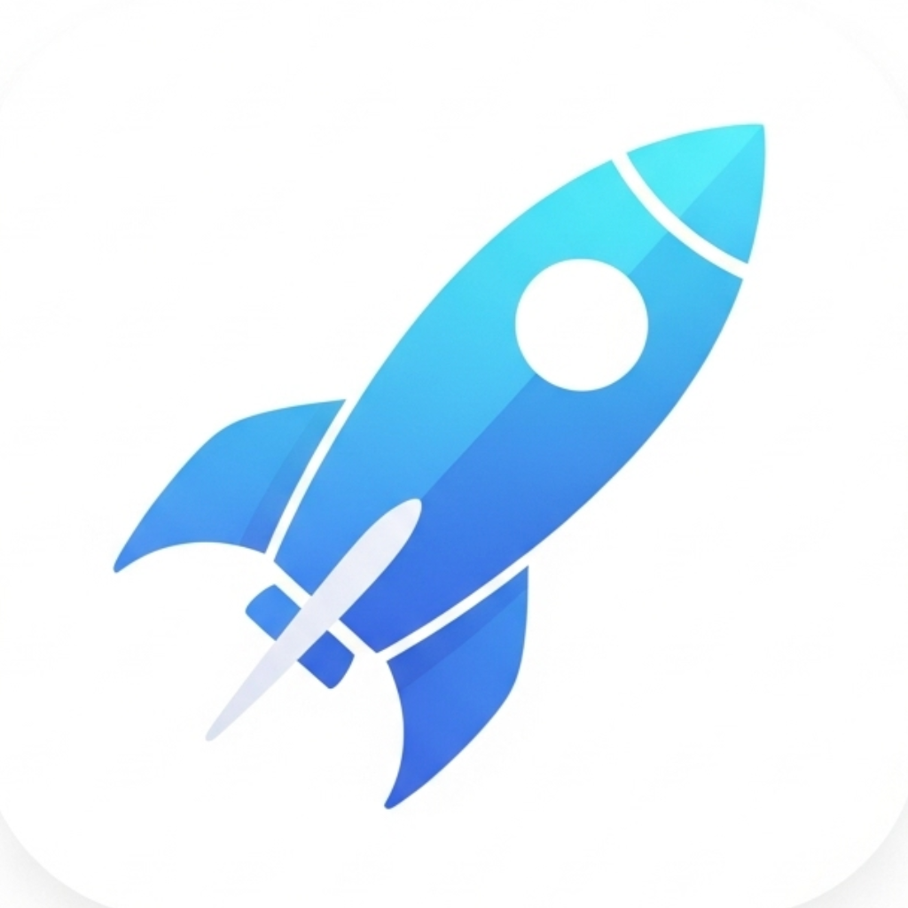

# LightLauncher

<div align="center">
  
  
  **快速、轻量、多功能的 macOS 应用启动器**
  
  [](https://swift.org)
  [](https://developer.apple.com/macos/)
  [](LICENSE)
</div>

## ✨ 功能特色

LightLauncher 不仅仅是一个应用启动器，它是一个集成多种功能的生产力工具：

### 🚀 **智能应用启动** (默认模式)
- **智能搜索算法**: 支持拼音、缩写、模糊匹配
- **使用频率学习**: 常用应用优先显示
- **快速访问**: 数字键 1-6 快速选择
- **缩写支持**: 自定义应用缩写，如 "ps" → "Photoshop"

### 💀 **应用管理** (`/k`)
- **快速关闭**: 搜索并关闭运行中的应用
- **批量操作**: 连续关闭多个应用而不退出模式
- **安全过滤**: 排除系统关键进程
- **状态显示**: 清晰显示应用运行状态

### 🌐 **网页搜索** (`/s`)
- **多搜索引擎**: 支持 Google、百度、必应
- **搜索历史**: 记录并快速重复搜索
- **智能建议**: 基于历史的搜索建议
- **一键搜索**: 直接在默认浏览器中打开结果

### 🌍 **网页快捷访问** (`/w`)
- **多格式支持**: 完整 URL、域名、关键词
- **书签集成**: 自动读取 Safari、Chrome、Edge、Firefox、Arc 浏览器书签
- **历史记录**: 智能匹配浏览器历史
- **智能补全**: 自动匹配最相关的网页

### 🖥️ **终端执行** (`/t`)
- **多终端支持**: Terminal.app、iTerm2、Ghostty、Kitty、Alacritty、WezTerm
- **智能检测**: 自动检测可用终端应用
- **安全执行**: 在用户选择的终端中执行命令
- **历史记录**: 保存常用命令以便快速重用

### 📁 **文件管理器** (`/o`)
- **目录浏览**: 从家目录开始，支持导航到任意目录
- **多起始路径**: 配置多个常用目录快速访问
- **文件操作**: 
  - **Enter**: 打开文件或进入目录
  - **Space**: 在 Finder 中显示当前选择
- **智能过滤**: 输入关键词快速筛选文件
- **详细信息**: 显示文件大小、修改时间和类型图标

## 🎯 快速开始

### 安装

1. **下载**: 从 [Releases](../../releases) 下载最新版本
2. **安装**: 将 `LightLauncher.app` 拖拽到 `应用程序` 文件夹
3. **启动**: 首次运行时，系统会要求授权辅助功能权限
4. **设置热键**: 默认热键为 `Option + Space`

### 基本使用

1. **唤起应用**: 按下热键 (默认 `Option + Space`)
2. **搜索应用**: 直接输入应用名称
3. **选择**: 使用 ↑↓ 箭头键或数字键 1-6 选择
4. **启动**: 按 `Enter` 启动选中的应用
5. **退出**: 按 `Esc` 关闭启动器

### 命令模式

输入 `/` 查看所有可用命令，然后：

- `/k` + 应用名 → 关闭应用
- `/s` + 搜索词 → 网页搜索  
- `/w` + 网址/关键词 → 打开网页
- `/t` + 命令 → 执行终端命令
- `/o` + 文件名 → 浏览文件

## ⚙️ 高级配置

### 配置文件位置
```
~/.config/LightLauncher/config.yaml
```

### 主要配置选项

```yaml
# 热键设置
hotKey:
  modifiers: 1024    # Option 键
  keyCode: 49        # Space 键

# 搜索目录
searchDirectories:
  - "/Applications"
  - "~/Applications"
  - "/System/Applications"

# 功能模式设置
modes:
  killModeEnabled: true
  searchModeEnabled: true
  webModeEnabled: true
  terminalModeEnabled: true
  fileModeEnabled: true
  showCommandSuggestions: true
  defaultSearchEngine: "google"
  preferredTerminal: "auto"
  enabledBrowsers: ["safari", "chrome"]
  fileBrowserStartPaths:
    - "~"
    - "~/Documents"
    - "~/Downloads"
    - "~/Desktop"

# 自定义缩写
commonAbbreviations:
  ps: ["photoshop", "adobe photoshop"]
  ai: ["illustrator", "adobe illustrator"]
  code: ["visual studio code", "vscode"]
  term: ["terminal", "iterm"]
```

### 自定义搜索目录

在设置中添加自定义应用搜索目录：
- 应用目录（如自定义安装位置）
- 开发工具目录
- 脚本和工具目录

### 浏览器数据集成

支持从以下浏览器读取书签和历史：
- **Safari**: 系统默认集成
- **Chrome**: 自动检测用户配置文件
- **Edge**: Microsoft Edge for Mac
- **Firefox**: 支持多配置文件
- **Arc**: The Browser Company 的 Arc 浏览器

## 🔧 技术架构

LightLauncher 采用现代化的 Swift 架构设计：

### 核心组件
- **SwiftUI**: 现代化的用户界面
- **Combine**: 响应式数据流
- **Core Data**: 可选的本地数据持久化
- **AppKit**: 系统级集成

### 架构特点
- **模块化设计**: 每个功能模式独立实现
- **命令模式**: 可扩展的命令处理系统
- **MVVM 架构**: 清晰的视图和逻辑分离
- **配置管理**: YAML 格式的人类可读配置

详细架构文档请参考 [ARCHITECTURE.md](ARCHITECTURE.md)

## 🎨 界面预览

### 主界面


### 应用搜索


### 文件浏览器


### 设置界面


## 🚀 性能特点

- **启动快速**: 冷启动时间 < 0.5s
- **响应迅速**: 搜索结果实时更新
- **内存友好**: 运行时内存占用 < 50MB
- **节能设计**: 后台时 CPU 占用接近 0%

## 🔒 隐私保护

- **本地处理**: 所有数据处理在本地完成
- **无网络请求**: 除网页搜索外无需网络连接
- **权限最小化**: 仅请求必要的系统权限
- **数据加密**: 敏感配置文件加密存储

## 🤝 贡献指南

我们欢迎社区贡献！请参考以下指南：

1. **Fork** 本仓库
2. **创建特性分支**: `git checkout -b feature/amazing-feature`
3. **提交更改**: `git commit -m 'Add amazing feature'`
4. **推送分支**: `git push origin feature/amazing-feature`
5. **提交 Pull Request**

### 开发环境要求
- macOS 11.0+
- Xcode 14.0+
- Swift 5.9+

### 构建项目
```bash
git clone https://github.com/username/LightLauncher.git
cd LightLauncher
swift build
```

## 📋 系统要求

- **操作系统**: macOS 11.0 (Big Sur) 或更高版本
- **架构**: Intel x64 或 Apple Silicon (M1/M2/M3)
- **RAM**: 最低 4GB，推荐 8GB+
- **存储**: 50MB 可用空间

## 🐛 问题反馈

如果您遇到问题或有功能建议，请：

1. 查看 [常见问题](../../wiki/FAQ)
2. 搜索现有 [Issues](../../issues)
3. 创建新的 [Issue](../../issues/new)

## 📄 许可证

本项目采用 MIT 许可证 - 查看 [LICENSE](LICENSE) 文件了解详情。

## 🎉 致谢

感谢所有贡献者和以下开源项目：

- [SwiftUI](https://developer.apple.com/xcode/swiftui/)
- [Yams](https://github.com/jpsim/Yams) - YAML 解析
- [LaunchAtLogin](https://github.com/sindresorhus/LaunchAtLogin) - 开机启动

## 📞 联系我们

- **项目主页**: [GitHub Repository](https://github.com/username/LightLauncher)
- **问题反馈**: [Issues](../../issues)
- **功能建议**: [Discussions](../../discussions)

---

<div align="center">
  Made with ❤️ for macOS users who love efficiency
</div>
