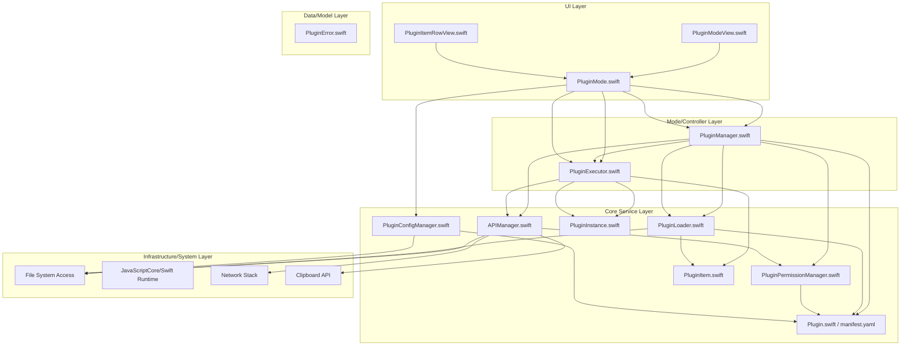

### **优化后的插件模式计划书 (AI Agent 实施版)**

#### **一、 优化后的核心架构设计**

为了实现高度模块化和可测试性，我们将架构明确划分为五个层次，上层依赖下层。这种设计使得各层可以独立开发和测试。

**架构释义:**

*   **UI Layer (视图层)**: 负责所有与插件相关的界面展示，完全由 `PluginMode` 提供数据和状态。
*   **Mode/Controller Layer (模式/控制器层)**: `PluginMode.swift` 作为“交通警察”，是UI与后台服务之间的唯一协调者。它从核心服务层获取数据，响应用户输入，并将结果传递给UI层。
*   **Core Service Layer (核心服务层)**: 系统的“引擎室”，包含所有核心逻辑。
    *   `PluginManager`: 所有插件的“注册中心”，负责插件的生命周期。
    *   `PluginLoader`: 负责将磁盘上的文件（`manifest.yaml`, `main.js`）解析成内存中的 `Plugin` 对象。
    *   `PluginExecutor`: 负责为 `PluginInstance` 创建并管理一个安全的运行环境（如 JSContext）。
    *   `APIManager`: 插件调用原生功能的唯一网关，所有调用都经过它。
    *   `PluginPermissionManager`: `APIManager` 的“门卫”，在执行任何敏感操作前进行权限校验。
    *   `PluginConfigManager`: 负责插件配置的持久化读写。
*   **Data/Model Layer (数据/模型层)**: 定义了整个系统的核心数据结构，它们是纯粹的数据容器，不包含业务逻辑。
*   **Infrastructure/System Layer (基础设施层)**: 对操作系统底层能力的抽象，如文件读写、网络请求等。

---

#### **二、 关键模块的职责与交互流程细化**

##### **流程1：应用启动与插件加载**

1.  **`PluginManager.shared.loadAllPlugins()`** - 应用启动时调用。
2.  `PluginManager` 扫描内置 (`LightLauncher.app/Contents/Plugins/`) 和外置 (`~/.config/LightLauncher/plugins/`) 插件目录。
3.  对于每个发现的插件目录，调用 **`PluginLoader.shared.load(from: directory)`**。
4.  `PluginLoader`:
    *   读取并解析 `manifest.yaml`，创建一个 `Plugin` 数据对象。如果解析失败，则抛出 `PluginError.manifestInvalid`。
    *   读取 `main.js` 的内容存入 `Plugin` 对象。
    *   将创建好的 `Plugin` 对象返回给 `PluginManager`。
5.  `PluginManager` 将加载成功的 `Plugin` 对象存储在内部列表中，并更新 `plugins.yaml` 总配置文件。
6.  同时，`PluginManager` 遍历所有加载的插件，并为每个插件调用 **`PluginConfigManager.shared.ensureConfigExists(for: plugin)`**，以确保其配置文件存在。

##### **流程2：用户输入与插件激活/执行**

1.  **用户输入** (`/p todo add "Finish the report"`) -> `MainInputHandler` 检测到前缀 `/p`。
2.  调用 **`PluginMode.shared.shouldActivate(for: text)`** 返回 `true`。
3.  系统切换到插件模式，调用 **`PluginMode.shared.enterMode(with: text)`**。
    *   `PluginMode` 从 `PluginManager` 获取所有可用插件的命令列表，构建 `commandMap`。
4.  用户输入变化，调用 **`PluginMode.shared.handleInput(text)`**。
5.  `PluginMode` 分析输入:
    *   **情况A：切换插件** - 输入 `todo add "Finish the report"`。
    *   `PluginMode` 从 `commandMap` 查到 `todo` 命令属于 "TodoPlugin"。
    *   如果 `activePlugin` 不是 "TodoPlugin" 的实例，则：
        *   调用旧 `activePlugin` 的 `cleanup()` (如果存在)。
        *   从 `PluginManager` 获取 "TodoPlugin" 的 `Plugin` 对象。
        *   调用 **`PluginExecutor.shared.createInstance(for: plugin)`** 创建一个新的 `PluginInstance`。
        *   `PluginExecutor` 会创建一个 `JSContext`，注入 `APIManager` 提供的所有 API，并加载 `main.js` 脚本。
        *   将新创建的 `PluginInstance` 设为 `activePlugin`。
    *   **情况B：与激活插件交互**
    *   `PluginMode` 将输入 `add "Finish the report"` (去掉命令部分) 传递给 **`activePlugin.handleInput(text)`**。
6.  `PluginInstance.handleInput` (在 JS 环境中) 被调用。
    *   JS 脚本解析输入，可能会调用 `api.display(...)` 来更新UI。
    *   JS 脚本通过 `Promise` 返回结果项 (`[PluginItem]`)。
7.  `PluginMode` 接收到结果，更新其 `displayableItems` 属性，SwiftUI 视图自动刷新。

---

#### **三、 分步实施计划 (Phased Implementation Plan)**

这是一个为 AI Agent 或开发团队设计的、循序渐进的实施路线图。

##### **Phase 1: 核心模型与加载机制 (Foundation)**

*   **目标**: 能够扫描、解析并加载插件的元信息，但不能执行它们。
*   **要实施的模块**:
    1.  **`PluginError.swift`**: 定义所有可能的错误类型。这是最优先的，因为它会贯穿所有模块。
    2.  **`Plugin.swift`**: 定义 `Plugin` 结构体和用于解析 `manifest.yaml` 的 `PluginManifest` (`Codable`)。
    3.  **`PluginLoader.swift`**: 实现 `load(from: directory)` 方法，专注于正确解析 `manifest.yaml` 和读取脚本内容。
    4.  **`PluginManager.swift`**: 实现 `loadAllPlugins()`，扫描目录，调用 `PluginLoader`，并将结果存储在内存中。
*   **验证标准**:
    *   单元测试：`PluginLoader` 能成功解析合法的 `manifest.yaml`，并对损坏的文件抛出正确的 `PluginError`。
    *   运行程序后，`PluginManager` 的插件列表中包含了所有文件系统中的有效插件。

##### **Phase 2: 插件执行环境 (Execution)**

*   **目标**: 能够创建一个独立的插件实例并在一个安全的沙箱环境中执行其代码。
*   **要实施的模块**:
    1.  **`APIManager.swift` (桩实现)**: 先创建一个空的 API 管理器，不提供任何实际功能，仅用于注入。
    2.  **`PluginInstance.swift`**: 定义实例的运行时属性（如 `JSContext`）。
    3.  **`PluginExecutor.swift`**: 实现 `createInstance(for: plugin)`。核心是创建 `JSContext`，将 `APIManager` 注入为全局对象（如 `lightlauncher.api`），并执行插件的 `main.js`。
*   **验证标准**:
    *   创建一个 "Hello World" 插件，其 `main.js` 仅包含 `console.log("Plugin loaded!")`。
    *   在 `PluginExecutor` 创建实例后，能在 Xcode 控制台看到这条日志。

##### **Phase 3: UI 集成与基本交互 (Integration)**

*   **目标**: 将插件的执行结果展示在 UI 上，并实现基本的命令激活流程。
*   **要实施的模块**:
    1.  **`PluginItem.swift`**: 实现 `DisplayableItem` 协议，定义插件返回项的数据结构。
    2.  **`PluginMode.swift`**: 实现核心逻辑：
        *   `enterMode`: 从 `PluginManager` 获取命令。
        *   `handleInput`: 实现上面“流程2”中描述的插件激活和输入分发逻辑。
        *   `displayableItems`: 暴露当前激活插件返回的结果。
    3.  **`PluginItemRowView.swift` & `PluginModeView.swift`**: 创建基本的 SwiftUI 视图来展示 `displayableItems`。
    4.  **`APIManager.swift` (功能增强)**: 实现第一个核心 API: `display(items: [PluginItem])`，允许 JS 调用此函数来更新 `PluginInstance` 的状态，最终更新到 `PluginMode` 的 `displayableItems`。
*   **验证标准**:
    *   创建一个“搜索”插件，输入 `/p search "keyword"`，插件返回包含 "keyword" 的硬编码列表，并成功展示在主窗口。
    *   可以切换不同的插件命令，`activePlugin` 会正确切换。

##### **Phase 4: 完整功能与安全 (Full Feature & Security)**

*   **目标**: 实现配置、权限和所有核心 API，使插件系统功能完整。
*   **要实施的模块**:
    1.  **`PluginConfigManager.swift`**: 实现插件配置的读写和默认配置的创建。
    2.  **`PluginPermissionManager.swift`**: 实现 `hasPermission(for: apiName)` 的检查逻辑。
    3.  **`APIManager.swift` (完全实现)**:
        *   为每个需要权限的 API（如 `readFile`, `networkRequest`）在执行前调用 `PluginPermissionManager`。
        *   实现文件、剪贴板、网络等所有在计划书中提到的 API。
*   **验证标准**:
    *   一个需要文件读取权限的插件，在 `manifest.yaml` 中未声明权限时调用 `readFile` 会失败。声明后则成功。
    *   插件可以成功读取自己的配置文件。
    *   可以创建一个“剪贴板历史”插件，并正常工作。

##### **Phase 5: 健壮性与开发者体验 (Polish)**

*   **目标**: 完善错误处理、提供清晰的文档和示例，优化整体体验。
*   **要实施的模块/工作**:
    1.  **错误处理**: 确保所有来自插件的 `PluginError` 都能被 `PluginMode` 捕获，并在 UI 上以友好的方式提示用户。
    2.  **完善 `getHelpText()`**: 聚合所有插件的帮助信息并展示。
    3.  **创建示例插件**: 编写多个功能各异的示例插件，作为开发者的参考。
    4.  **编写开发者文档**: 详细说明 `manifest.yaml` 的所有字段、所有可用 API 的用法和权限要求。
*   **验证标准**:
    *   当插件脚本执行出错时，用户会看到明确的错误提示，而不是程序崩溃。
    *   新开发者可以依据文档和示例快速开发自己的插件。

---

这个优化后的计划书提供了更清晰的蓝图和可执行的路径，非常适合 AI Agent 或结构化思维的开发团队逐步构建一个健壮、可扩展的插件系统。